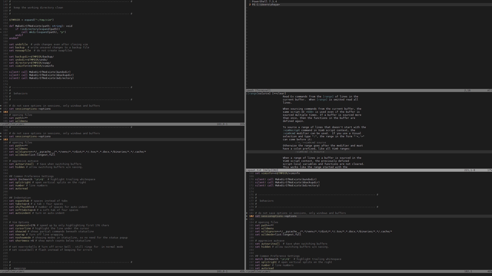
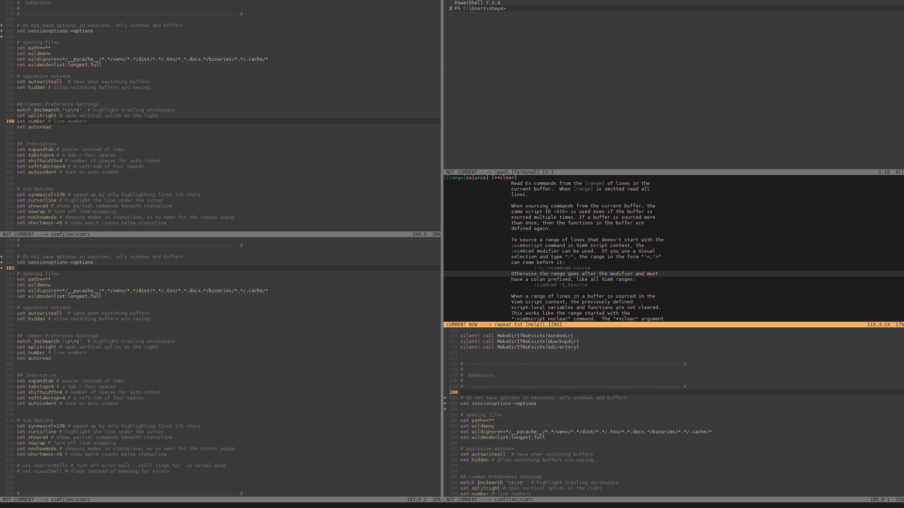
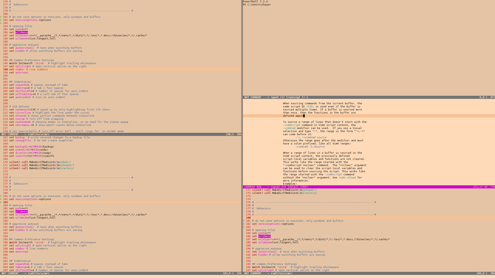
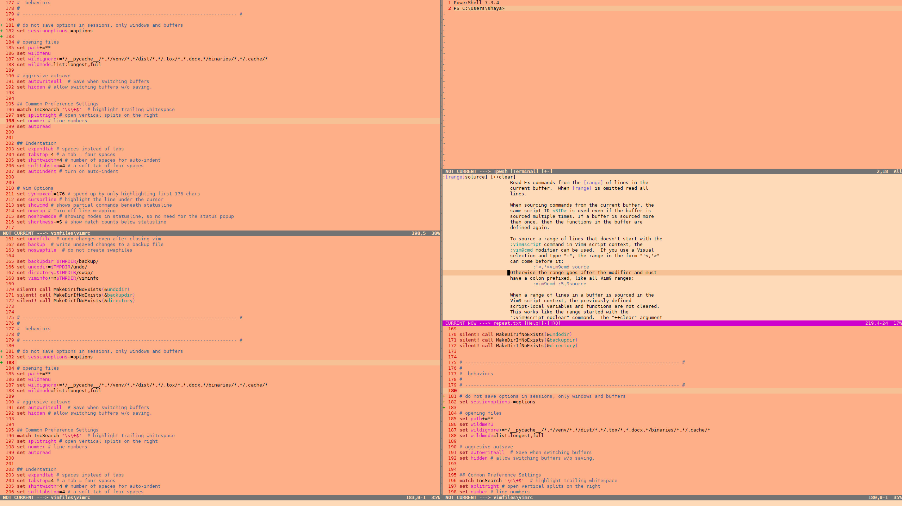
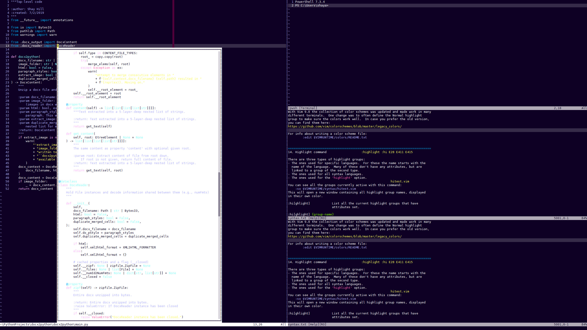
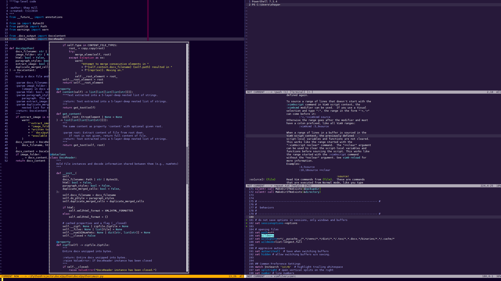

# vim9-focalpoint

Shade unfocused windows. Give a bright statusline color for active windows *when splits are open*.

Statuslines in Vim are by default highlighted with the StatusLine and StatusLineNC (StatusLine Not Current) highlight groups. When no splits are open, you will only see the StatusLine highlight group. When splits *are* open, the focused split will have the StatusLine highlight and unfocused splits will have the StatusLineNC highlight.

Often, I would prefer more contrast between these groups, so this module creates a third highlight group for statuslines, StatusLineCN (StatusLine Current Now), plus some variants. When no splits are open, you will only see the StatusLine highlight group (a nice, coordinating color as the colorscheme designer intended it). When splits *are* open, the focused split will have the high-contrast StatusLineCN highlight and unfocused splits will have the StatusLineNC highlight.

If that's not enough help, the vim9-focalpoint will also shade unfocused windows when splits are open.

|  |  |
| - | - |
| without focalpoint | with focalpoint |

Here it is with some of the default colorschemes: [vim9-focalpoint](https://www.youtube.com/watch?v=XkErei9LtSU)

## What do you get?

You will not see a change after installing this plugin. Everything you get is "under the hood" and will require some light assembly. (see file `example_config.vim`)

### New highlight groups

Vim9-focalpoint creates 8 new highlight groups, 7 for statuslines, and 1 for window backgrounds. This gives a total of 2 background highlight groups and 9 StatusLine highlight groups. Beneath each highlighting group, I've included the definition Vim9-focalpoint will create if you are using the Habamax colorscheme. You don't have to use any of these, but they are provided for your convenience. You can use `g:FPHiSelect` to select from any highlight group you desire.

#### The statusline when only one split is open

```
StatusLine xxx term=bold,reverse ctermfg=234 ctermbg=247 guifg=#1c1c1c guibg=#9e9e9e
StatusLineHard xxx term=bold,reverse cterm=bold ctermfg=234 ctermbg=247 gui=bold guifg=#1c1c1c guibg=#9e9e9e
StatusLineSoft xxx term=bold,reverse ctermfg=242 ctermbg=247 guifg=#707070 guibg=#9e9e9e
```

#### The statusline of unfocused splits when splits are open

```
StatusLineNC   xxx term=reverse ctermfg=234 ctermbg=243 guifg=#1c1c1c guibg=#767676
StatusLineNCHard xxx term=bold,reverse cterm=bold ctermfg=234 ctermbg=243 gui=bold guifg=#1c1c1c guibg=#767676
StatusLineNCSoft xxx term=reverse ctermfg=240 ctermbg=243 guifg=#565656 guibg=#767676
```

#### The statusline of focused splits when splits are open

```
StatusLineCN   xxx term=reverse cterm=reverse ctermfg=215 ctermbg=234 gui=reverse guifg=#ffaf5f guibg=#1c1c1c
StatusLineCNHard xxx term=bold,reverse cterm=bold,reverse ctermfg=215 ctermbg=234 gui=bold,reverse guifg=#ffaf5f guibg=#1c1c1c
StatusLineCNSoft xxx term=reverse cterm=reverse ctermfg=215 ctermbg=137 gui=reverse guifg=#ffaf5f guibg=#af7b47
```

#### The background color of focused and unfocused splits

```
Normal         xxx ctermfg=250 ctermbg=234 guifg=#bcbcbc guibg=#1c1c1c
NormalNC       xxx ctermbg=237 guibg=#3a3a3a
```

### Two functions for choosing content and format based on window state

~~~vim
def g:FPSelect(
    winid: number,
    statusline: string,
    not_current: string,
    current_now: string
): string
~~~

This function will look at the winid and decide if the window is `normal` (only one split is open), `not_current` (unfocused split), or `current_now` (focused split when splits are open). It will then select and return the appropriate string as a highlight group. This can be used to insert different text in different states.

~~~vim
def g:FPHiSelect(
    winid: number,
    statusline: string,
    not_current: string,
    current_now: string
): string
~~~

The same as above, but wraps each string argument in `%#string#` so that it can be directly inserted into a statusline string. See `h: statusline` for instructions on building a statusline.

### Putting it all together

I've included `example_config.vim`. You can work from that or use the examples to see how to build your own. Here's an expanded description of how everything works.

To use these functions, you will build a statusline-generating function that takes one argument, `g:statusline_winid`, that Vim generates on it's own. After creating this function, you will tell Vim to use it to generate your statuslines. `set statusline=%!GenerateStatusline(g:statusline_winid)`

~~~vim
set laststatus=2

def g:GenerateStatusline(winid: number): string
    var stl = ""

    # g:FPHiSelect chooses a highlight group based on winid
    var hi_group = g:FPHiSelect(winid, 'StatusLine', 'StatusLineNC', 'StatusLineCN')

    # g:FPSelect chooses a string based on winid
    var state = g:FPSelect(winid, 'STATUS LINE', 'NOT CURRENT', 'CURRENT NOW')

    # set your highlighting
    stl ..= hi_group

    # show the state, to help show what is going on
    stl ..= ' ' .. state .. ' --->'

    # show a few of the usual items
    stl ..= ' %f %h%w%m%r %=%(%l,%c%V %= %P%'

    return stl
enddef

set statusline=%!GenerateStatusline(g:statusline_winid)
~~~

If you are using vim9script, you can copy and paste the last code block into your vimrc. You'll have a simple statusline that performs the neat trick of brightening up when you have splits open. Once you understand how it works, you can build something more elaborate, changing highlight groups as many times as you like to make every element three unique (one per state) colors if you wish.

I've provided the 7 new highlight groups for convenience, but you can use `g:FPHiSelect` to select from any highlight group you desire or create.

`:hi<CR>` to see what's already defined.

### Window shading

Vim does this almost by itself, you just need a simple autocmd and a highlight group to use. A few colorschemes have such a highlight group, but Vim9-focalpoint creates such a group for *any* colorscheme. Use NormalNC for this purpose.

~~~vim
augroup ShadeNotCurrentWindow
  autocmd!
  autocmd WinEnter * setl wincolor=Normal
  autocmd WinLeave * setl wincolor=NormalNC
augroup END
~~~

That's all you need to shade your "not current" windows. If you don't want it, don't put the autocmd in your vimrc.

### What else?

The statusline function is called a lot, so I've kept in lean by cacheing the newly created highlight groups. If you change colorschemes, you'll want to call g:FPReset() to create new highlight groups from the new colorscheme.

~~~vim
augroup ResetStatuslineHiGroups
  autocmd!
  autocmd colorscheme * g:FPReset()
augroup END
~~~

That will re-create coordinating StatusLineHard, StatusLineCN, NormalNC, etc. groups from the new colorscheme.

## Configuration?

Not really. I like to change colorschemes depending on the lighting and whether I'm wearing my tinted computer glasses. It's always bothered me that, with statusline plugins, I've had to switch statusline themes when I switched colorschemes to keep everything looking nice. Vim9-focalpoint does not use colorschemes. It selects/creates colors from whatever colorscheme you are using. If you use the 9 default highlight groups and 2 default background colors, this is what you'll get: colors selected or created (by mixing) from your current colorscheme. That being said, there are a few things you can tweak.

### statusbar colors

Vim9-statusline is configured to search for a contrasting statusline color in these highlight groups, most preferred to least.

~~~vim
g:focalpoint_cn_candidates = ['IncSearch', 'Search', 'ErrorMsg']
~~~

You can re-order, shrink, or expand this list in your vimrc. Be aware that if vim9-focalpoint cannot find something appropriate in your list, it is written to fail silently and revert to the default Vim statusline highlight behavior.

### grayed-out text

Vim9-statusline "grays out" text for the [Basename]Soft hightlight groups by mixing foreground and background colors at a specified ratio. You can change this ratio in your vimrc. Be aware that terminal colors are defined in wide, discrete colors (there are only 256 of them in total), so a small ratio might not be enough mixing to change the text color at all. A too-large ratio might push the text color all the way into the background color.

~~~vim
g:focalpoint_text_fade = 0.65
~~~

### background shading

Vim9-statusline creates the NormalNC highlight group by mixing the default (Normal) foreground and background colors at a specified ratio. You can change this ration in your vimrc. As with focalpoint_text_fade, be aware that too small or too large ratios can eliminate the effect entirely in the terminal.

~~~vim
g:focalpoint_bg_fade = 0.1
~~~

### more background shading

Vim9-statusline creates a shaded background color by mixing foreground and background colors at a specified ratio. This creates a nice, muted shade for most achromatic backgrounds, but some colorschemes (peachpuff is a nice example) have a more chromatic "lowlight" color specified for their popup menus. You can set `g:focalpoint_use_pmenu = v:true` to shade unfocused windows with the Pmenu background instead of the custom background created by Vim9-statusline.

|  |  |
| - | - |
| `g:focalpoint_use_pmenu = v:false` | `g:focalpoint_use_pmenu = v:true` |

Some of these Pmenu backgrounds are terrible (white background with white text), so you may wish to specify `g:focalpoint_use_pmenu = v:true` for some colorschemes and `v:false` for others. You can accomplish that with this snippet.

~~~vim
g:use_pmenu_to_shade = [
    'delek',
    'habamax',
    'industry',
    'koehler',
    'lunaperche',
    'morning',
    'pablo',
    'peachpuff',
    'quiet',
    'retrobox',
    'torte',
    'wildcharm',
]

augroup ResetStatuslineHiGroups
  autocmd!
  autocmd colorscheme * g:focalpoint_use_pmenu = index(g:use_pmenu_to_shade, g:colors_name) != -1 ? v:true : v:false | g:FPReset()
augroup END
~~~

#### bonus feature

Some of the included colorschemes are nice (e.g., zaibatsu) with one glaring exception: their popup-menu backgrounds are unreadable. If `g:focalpoint_use_pmenu = v:false` (the default), vim9-focalpoint will replace the theme Pmenu highlight group with the NormalNC color created by vim9-focalpoint.

|  |  |
| - | - |
| zaibatsu without focalpoint | zaibatsu with focalpoint |

### roll your own

You can also use your own highlight groups in your GenerateStatusline function. They won't change with the colorscheme, but that might be what you want. You could build something out with triangle separators and multiple colors if that's what you wanted to do.

## What if I only want the statusline or only want the window shading?

Leave out the relevant parts from your vimrc, and you won't get statusline enhancement or unfocused window shading. You will have a few extra highlight groups defined, but that's it. No extra functions will be called after startup. The overhead for the unused functionality will be exactly zero.

## What if I don't use vim9script in my vimrc?

If you know just a bit of vimscript, you can revert the above functions to classic vimscript. You can run the plugin if you're using Vim9+, no matter what style you use in your vimrc. If you don't want to script anything, you could create a new file in your vimfolder, type vim9script on the top line, paste the above code sections into it, then source that from your vimrc.
